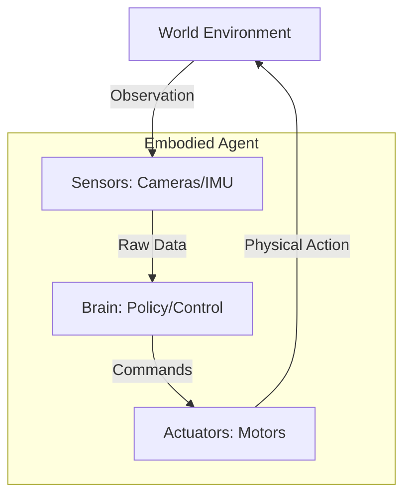
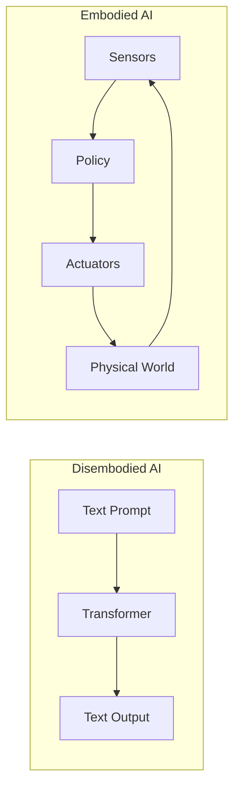
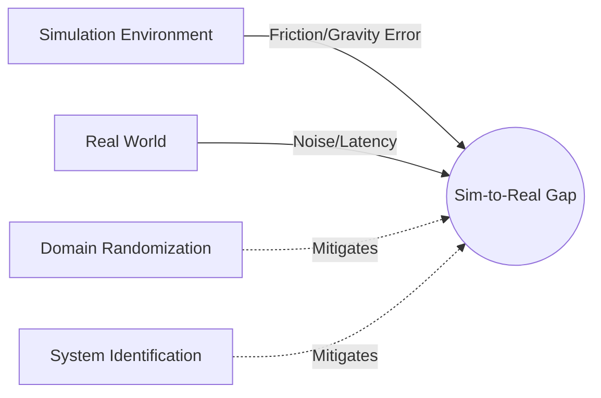
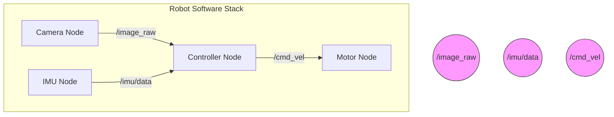
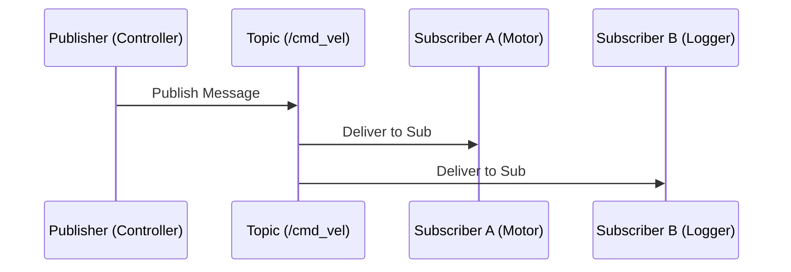

# Chapter 1: Introduction to Physical AI - Diagram Specifications

This document contains the visual specifications for the first chapter of the AI-native robotics textbook.

## Figure 1.1: Sensorimotor Loop

### ASCII Representation
```text
          ┌──────────────────────────────────────────┐
          │                  WORLD                   │
          │    (Physics, Objects, Environment)       │
          └────┬────────────────────────────────▲────┘
               │                                │
        Sensory Inputs                    Control Actions
          (Observation)                    (Actuation)
               │                                │
    ┌──────────▼──────────┐            ┌────────┴──────────┐
    │       SENSORS       │            │     ACTUATORS     │
    │ (Cameras, IMU, LIDAR)            │  (Motors, Servos) │
    └──────────┬──────────┘            └────────▲──────────┘
               │                                │
          Raw Data                       Motor Commands
               │                                │
    ┌──────────▼────────────────────────────────┴──────────┐
    │                        BRAIN                         │
    │        (Perception -> Planning -> Control)           │
    └──────────────────────────────────────────────────────┘
```

### Mermaid Diagram


### Description for Docusaurus

**Alt Text:**
Flowchart showing the circular relationship between World, Sensors, Brain, and Actuators.

**Caption:**
Figure 1.1: The fundamental sensorimotor loop of a physical AI agent.

**Explanation:**
This diagram illustrates the continuous cycle of embodied intelligence. The "Brain" (computational stack) processes sensory data to output motor commands. These commands drive actuators that affect the physical world, which in turn changes the sensory input, closing the loop.

---

## Figure 1.2: LLM vs Embodied AI

### ASCII Representation
```text
      DISEMBODIED AI (LLM)                  EMBODIED AI (ROBOT)
    ┌──────────────────────┐              ┌────────────────────────┐
    │      Cloud/Server    │              │ Physical Agent in Situ │
    │ ┌──────────────────┐ │              │  ┌──────────────────┐  │
    │ │  Neural Network  │ │              │  │  Neural Network  │  │
    │ └──────────────────┘ │              │  └──────────────────┘  │
    └──────────▲───────────┘              └─────▲──────────┬───────┘
               │                                │          │
         Text Prompt (Input)             Sensor Data    Actuation
               │                        (Vision/Touch)  (Movement)
               │                                │          │
    ┌──────────▼───────────┐              ┌─────┴──────────▼───────┘
    │    Text Response     │              │     Physical World     │
    └──────────────────────┘              └────────────────────────┘
```

### Mermaid Diagram


### Description for Docusaurus

**Alt Text:**
Side-by-side comparison of a linear text-in/text-out LLM vs a circular sensor-actuator Embodied AI.

**Caption:**
Figure 1.2: Contrast between disembodied LLMs and embodied Physical AI.

**Explanation:**
Highlights the primary difference in interaction interfaces. While LLMs operate in a symbolic domain (tokens in, tokens out), Embodied AI must bridge the gap between digital computation and continuous physical dynamics.

---

## Figure 1.3: Sim-to-Real Gap

### ASCII Representation
```text
      SIMULATION (SOURCE)                    REAL WORLD (TARGET)
    ┌──────────────────────┐              ┌──────────────────────┐
    │      Ideals          │              │      Reality         │
    │  Perfect Physics     │     GAP      │   Complex Friction   │
    │  Zero Latency        │   ───────>   │   Signal Latency     │
    │  Clean Sensors       │              │   Sensor Noise       │
    └──────────┬───────────┘              └──────────┬───────────┘
               │                                     │
               └───────── Domain Randomization ──────┘
                         (Bridging techniques)
```

### Mermaid Diagram


### Description for Docusaurus

**Alt Text:**
Diagram showing Simulation and Real World separated by a gap labeled with discrepancies like friction and latency.

**Caption:**
Figure 1.3: Visualizing the Sim-to-Real Gap and mitigation strategies.

**Explanation:**
The "Gap" represents the discrepancy between simulated physics and real-world results. Strategies like Domain Randomization perturb simulation parameters so the learned policy becomes robust enough to transfer to the messy reality of the physical world.

---

## Figure 1.4: ROS 2 Node Architecture

### Mermaid Diagram


### Description for Docusaurus

**Alt Text:**
Graph of four ROS 2 nodes connected via specific topic names used for sensor data and motor commands.

**Caption:**
Figure 1.4: Distributed ROS 2 node architecture for a typical robot.

**Explanation:**
This shows the modularity of ROS 2. Each node handles a specific hardware or logic component. Communication is decoupled; the Controller node doesn't need to know which specific camera is providing images, only that the `/image_raw` topic is available.

---

## Figure 1.5: Pub/Sub Message Flow

### ASCII Representation
```text
   PUBLISHER              TOPIC (HUB)             SUBSCRIBER
      │                       │                       │
      │   msg: /cmd_vel       │                       │
      │ ────────────────────> │                       │
      │                       │                       │
      │                       │   msg: /cmd_vel       │
      │                       │ ────────────────────> │
      │                       │                       │
      │                       │   msg: /cmd_vel       │
      │                       │ ────────────────────> │
      │                       │                       │ (Sub 2)
```

### Mermaid Diagram


### Description for Docusaurus

**Alt Text:**
Sequence diagram showing a message originating from a publisher, hitting a topic, and being distributed to multiple subscribers.

**Caption:**
Figure 1.5: Asynchronous Publish/Subscribe messaging pattern.

**Explanation:**
Illustrates the 1-to-many capability of the ROS 2 bus. A single command (publisher) can be consumed by both the motor driver (to move) and a logging tool (to record data) simultaneously without the publisher knowing who the subscribers are.
