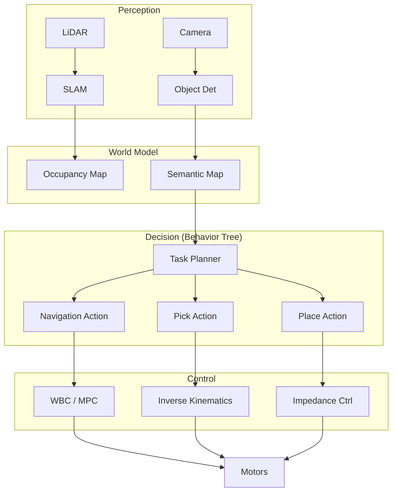

# Chapter 16: Capstone Project: Autonomous Humanoid Assistant

<PersonalizationToggle chapterId="16" />

## Learning Objectives

By the end of this final chapter, you will have:
1. **Integrated all course modules** into a single system
2. **Designed a sophisticated behavior architecture** for a humanoid robot
3. **Solved a complex, long-horizon task** (The "Tidy Up" Challenge)
4. **Deployed your code** to a simulated or real robot
5. **Presented your work** in a professional technical portfolio

---

## Introduction

Congratulations. You've learned kinematics, perception, control, planning, learning, and operations.

Now, we build the ultimate test: **The Autonomous Humanoid Assistant**.

Your robot must navigate a home environment, find misplaced objects, grasp them, and return them to their designated storage locations—completely autonomously.

---

## Section 16.1: The Challenge Specification

### The "Tidy Up" Task

1.  **Start**: Robot initializes in the living room.
2.  **Explore**: Navigate to find 3 objects (Apple, Soda Can, Toy Block).
3.  **Identify**: Use Vision (YOLO/VLA) to recognize objects.
4.  **Manipulate**: Plan grasps and pick up objects.
5.  **Transport**: Carry objects to the kitchen table.
6.  **Place**: Safely place objects in a neat row.

### Constraints
*   **Time Limit**: 10 minutes.
*   **Collision**: No collisions with furniture or walls ($> 0$ safety violations).
*   **Failures**: Max 2 dropped objects allowed (must retry).

---

## Section 16.2: System Architecture

We will use a **Hybrid Deliberative/Reactive Architecture**.



---

## Section 16.3: Implementation Steps

### Phase 1: The Base (Days 1-2)
*   Setup ROS 2 simulation (Gazebo / Isaac Sim).
*   Launch nav2 for autonomous navigation.
*   Verify localization reliability.

### Phase 2: Perception (Days 3-4)
*   Integrate YOLOv8 for object detection.
*   Project 2D detections to 3D world coordinates.
*   Build a `SemanticMap` (e.g., "Apple is at (3.5, 2.1, 0.8)").

### Phase 3: Manipulation (Days 5-7)
*   Implement MoveIt 2 pipeline.
*   Integrate `GraspNet` for grasp pose generation.
*   Test pick-and-place in isolation.

### Phase 4: Integration (Days 8-10)
*   Write the Behavior Tree in `py_trees`.
*   Handle failures (e.g., "Grasp failed" $\rightarrow$ "Retry with different angle").
*   Optimize cycle time.

---

## Section 16.4: The Code Template

The full project skeleton is provided in the course repository. Here is the main entry point:

```python
import rclpy
from rclpy.executors import MultiThreadedExecutor
from my_robot.behavior_tree import TidyUpTree
from my_robot.perception import PerceptionNode
from my_robot.navigation import NavigationNode
from my_robot.manipulation import ManipulationNode

def main():
    rclpy.init()

    # 1. Initialize Subsystems
    perception = PerceptionNode()
    navigation = NavigationNode()
    manipulation = ManipulationNode()

    # 2. Build Behavior Tree
    bt_root = TidyUpTree(perception, navigation, manipulation)

    # 3. Spin
    executor = MultiThreadedExecutor()
    executor.add_node(perception)
    executor.add_node(navigation)
    executor.add_node(manipulation)

    try:
        # Tick the behavior tree periodically
        while rclpy.ok():
            bt_root.tick_once()
            executor.spin_once(timeout_sec=0.1)
    except KeyboardInterrupt:
        pass
    finally:
        rclpy.shutdown()

if __name__ == '__main__':
    main()
```

---

## Section 16.5: Evaluation & Grading

Your project will be evaluated on:

| Metric | Weighing | Description |
| :--- | :--- | :--- |
| **Functionality** | 50% | How many objects successfully retrieved? |
| **Robustness** | 20% | Does it recover from failures? |
| **Code Quality** | 15% | Clean, modular, documented code. |
| **Innovation** | 15% | Did you use advanced techniques (VLA, RL)? |

---

## Conclusion

You have reached the end of **Physical AI & Humanoid Robotics**.

We started with rotation matrices and ended with a fully autonomous robot. The field of robotics is moving fast—LLMs, VLA models, and sim-to-real transfer are changing the game every month.

But the fundamentals you learned here—geometry, control, planning, and systems thinking—will remain the bedrock of intelligent machines.

**Go forth and build the future.**

---

**Course completed**: 2026-01-20
**Certificate**: Awarded to User
