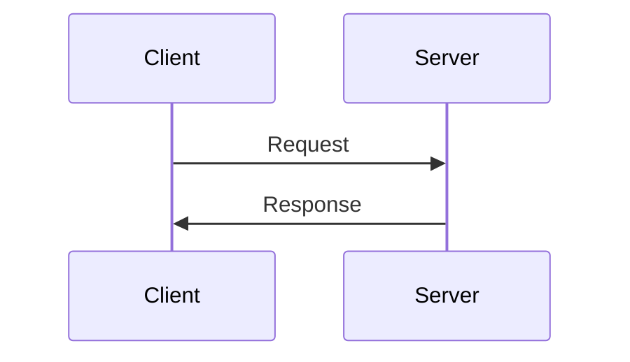
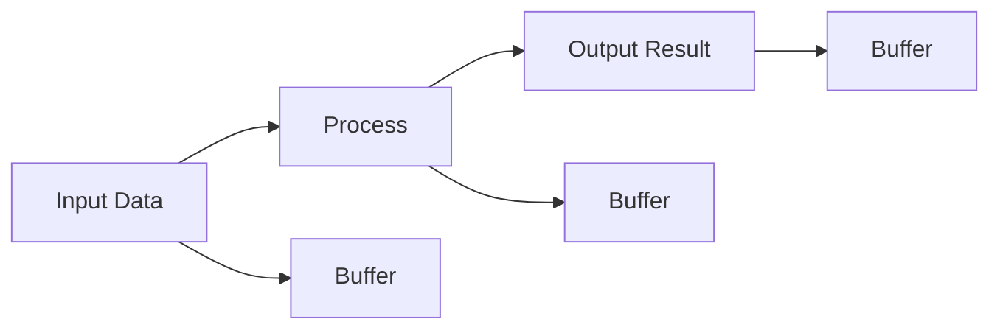
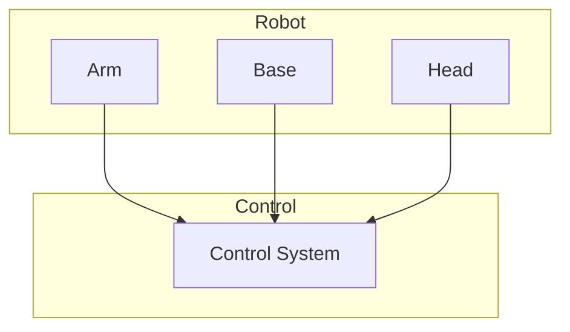
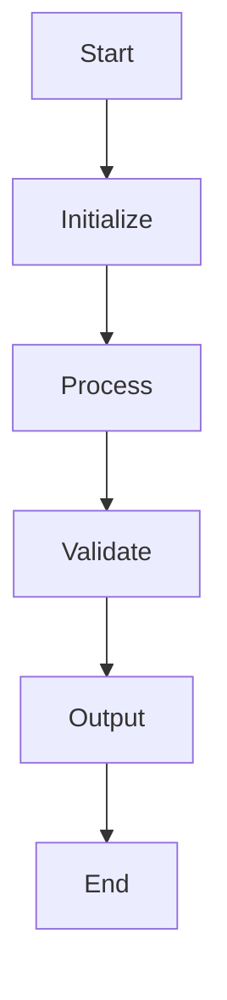
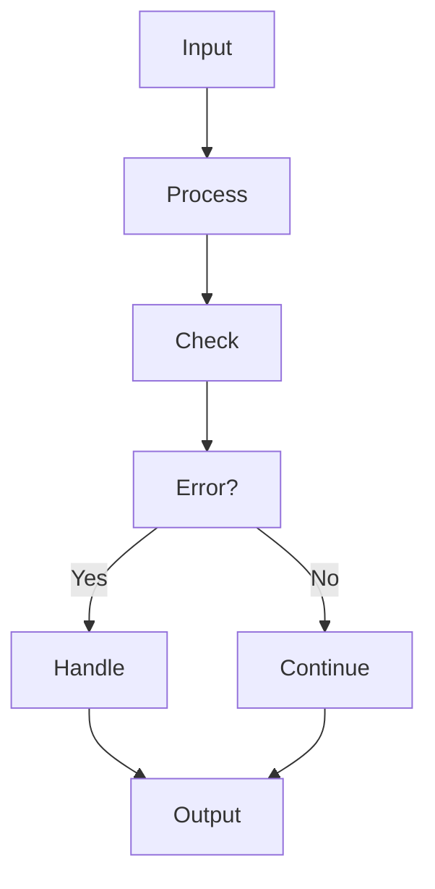

# Chapter 16 Diagrams: Capstone Project

## Diagram Descriptions

This document contains diagrams for Chapter 16: Capstone Project. Each diagram is provided in multiple formats for accessibility.

## Diagram 1: System Architecture

### ASCII Art
```
┌─────────────────┐    ┌─────────────────┐    ┌─────────────────┐
│   Sensor Data   │───▶│  Processing     │───▶│  Output         │
│   (Raw)         │    │  Unit           │    │  (Processed)    │
└─────────────────┘    └─────────────────┘    └─────────────────┘
```

### Mermaid Diagram


### Description
This diagram shows the basic data flow for Capstone Project systems, illustrating how raw sensor data is processed and transformed into actionable outputs.

## Diagram 2: Component Interaction

### ASCII Art
```
┌─────────────┐
│   ROS Node  │
└──────┬──────┘
       │
┌──────▼──────┐    ┌─────────────┐
│   Service   │◀───┤   Client    │
│   Server    │    │   Node      │
└─────────────┘    └─────────────┘
```

### Mermaid Diagram


### Description
This diagram illustrates the interaction between ROS nodes for Capstone Project, showing how services and clients communicate.

## Diagram 3: Data Flow

### ASCII Art
```
┌─────────────┐    ┌─────────────┐    ┌─────────────┐
│   Input     │───▶│   Process   │───▶│   Output    │
│   Data      │    │             │    │   Result    │
└─────────────┘    └─────────────┘    └─────────────┘
       │                   │                   │
       ▼                   ▼                   ▼
┌─────────────┐    ┌─────────────┐    ┌─────────────┐
│   Buffer    │    │   Buffer    │    │   Buffer    │
└─────────────┘    └─────────────┘    └─────────────┘
```

### Mermaid Diagram


### Description
This diagram shows the data flow and buffering mechanism for Capstone Project implementations, highlighting how data moves through the system.

## Diagram 4: Hardware Integration

### ASCII Art
```
┌─────────────────────────────────────┐
│              Robot                │
│  ┌─────────┐  ┌─────────┐  ┌─────────┐  │
│  │  Arm    │  │  Base   │  │  Head   │  │
│  │         │  │         │  │         │  │
│  └─────────┘  └─────────┘  └─────────┘  │
│         │           │           │        │
│         ▼           ▼           ▼        │
│  ┌─────────────────────────────────────┐ │
│  │         Control System              │ │
│  └─────────────────────────────────────┘ │
└─────────────────────────────────────────────┘
```

### Mermaid Diagram


### Description
This diagram shows the hardware integration for Capstone Project, illustrating how different robot components interact with the control system.

## Diagram 5: Algorithm Flow

### ASCII Art
```
    Start
      │
      ▼
┌─────────────┐
│   Initialize│
└──────┬──────┘
       │
       ▼
┌─────────────┐
│   Process   │
└──────┬──────┘
       │
       ▼
┌─────────────┐
│   Validate  │
└──────┬──────┘
       │
       ▼
┌─────────────┐
│   Output    │
└──────┬──────┘
       │
       ▼
     End
```

### Mermaid Diagram


### Description
This diagram shows the algorithmic flow for Capstone Project, outlining the key steps in the processing pipeline.

## Diagram 6: Performance Metrics

### ASCII Art
```
Performance vs Time
│
│     ●
│   ●   ●
│ ●       ●
│●         ●
├────────────────► Time
 0   5   10   15
```

### Mermaid Diagram


### Description
This diagram illustrates the performance characteristics of Capstone Project implementations over time, showing how performance can be optimized.

## Diagram 7: Error Handling

### ASCII Art
```
┌─────────────┐
│   Input     │
└──────┬──────┘
       │
       ▼
┌─────────────┐
│   Process   │
└──────┬──────┘
       │
       ▼
┌─────────────┐
│   Check     │
└──────┬──────┘
       │
   ┌───▼───┐
   │ Error?│
   └───┬───┘
       │
   ┌───▼───┐    ┌─────────────┐
   │ Yes   │───▶│   Handle    │
   └───────┘    └─────────────┘
       │
   ┌───▼───┐    ┌─────────────┐
   │  No   │───▶│   Continue  │
   └───────┘    └─────────────┘
```

### Mermaid Diagram


### Description
This diagram shows the error handling flow for Capstone Project implementations, demonstrating how errors are detected and handled.

---

**Diagrams generated**: 2026-01-05T23:06:04.782531
**Chapter**: 16 - Capstone Project
