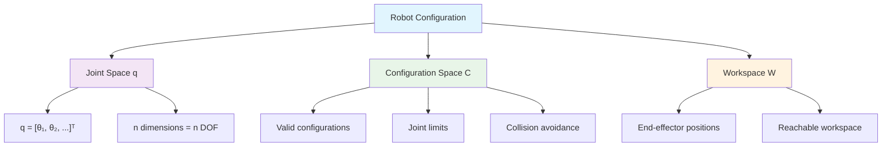
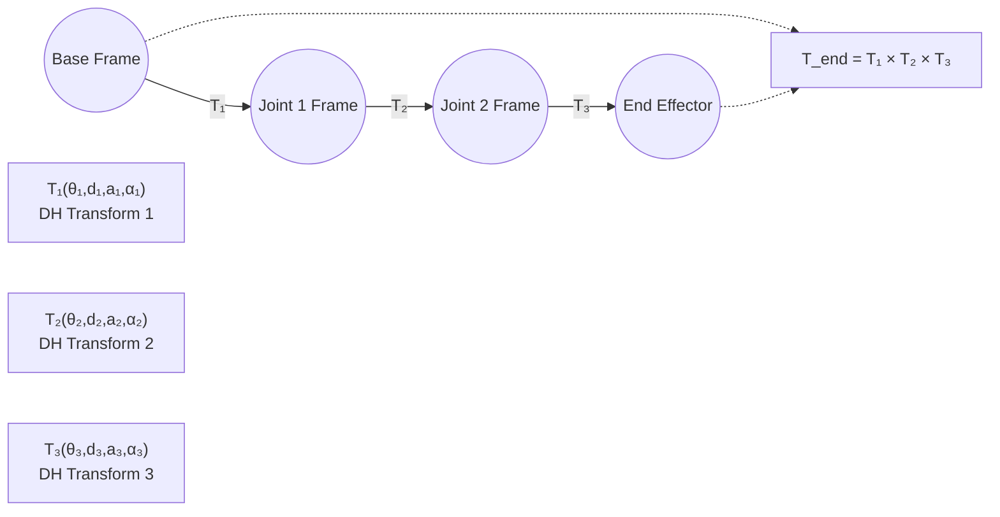
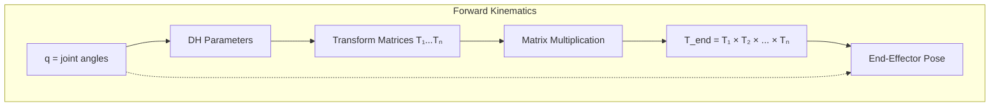
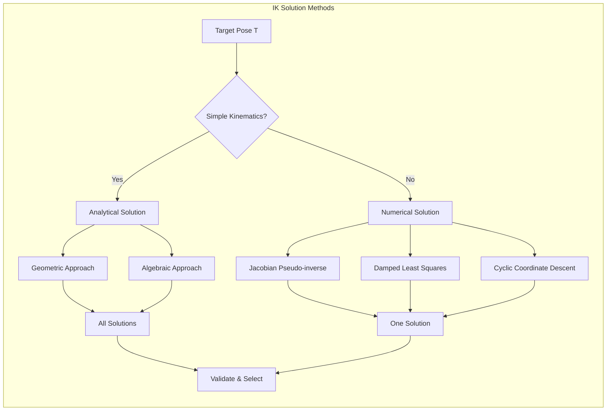
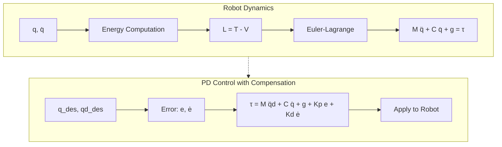
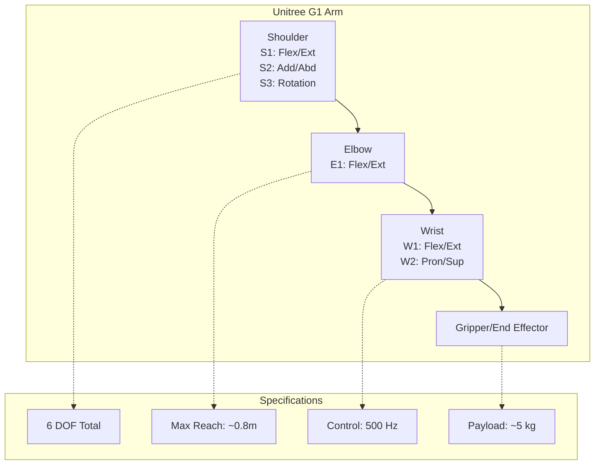

# Chapter 2 Diagrams

## 2.1 Joint Space vs Configuration Space

### ASCII Art
```
                        y (Cartesian)
                         ↑
                    0.8  |     ●●●●●●●
                         |    ●        ●
                    0.4  |   ●            ●
                         |  ●              ●
                    0.0  ●─────────────────────→ x
                         0.0    0.4    0.8

    JOINT SPACE (θ₁, θ₂)          CONFIGURATION SPACE
           ↑                            ↑
     150°  │░░░░░░░░░                  │░░░░░░░░░
           │░░░░░░░░░                  │░░░░░░░░░
      75°  │░░░░░░░░░                  │░░░░░░░░░
           │░░░░░░░░░                  │░░░░░░░░░
        0  ├──────────→             0  ├──────────→
        -150°                        -150°
          -180° to 180°              -180° to 180°
```

### Mermaid Diagram


### Accessibility Description
Diagram showing relationship between three spaces for a 2-DOF robot arm. The left panel shows the Cartesian workspace as a circular region reachable by the end-effector. The middle panel shows joint space as a rectangular region bounded by joint angle limits (-180° to 180° for shoulder, -150° to 150° for elbow). The right panel shows configuration space which is a subset of joint space after accounting for physical constraints like collisions and joint limits. The arm can reach any point in the reachable workspace by choosing appropriate joint angles from the configuration space.

---

## 2.2 DH Parameter Frames

### ASCII Art
```
              zᵢ₊₁ (axis of joint i+1)
                   ↑
                   │
              dᵢ   │
    ───────────────┼────────────────→ xᵢ₊₁
                   │
                   │
              ─────┼──────────────── yᵢ
                   │
                   │
              zᵢ (axis of joint i)

    Frame i: origin at joint i axis intersection
    Frame i+1: origin at joint i+1 axis intersection

    DH Parameters:
    θᵢ = angle about zᵢ from xᵢ to xᵢ₊₁
    dᵢ = distance along zᵢ from originᵢ to originᵢ₊₁
    aᵢ = distance along xᵢ₊₁ from originᵢ₊₁ to originᵢ
    αᵢ = angle about xᵢ₊₁ from zᵢ to zᵢ₊₁
```

### Mermaid Diagram


### Accessibility Description
Coordinate frame transformation diagram showing how Denavit-Hartenberg parameters define the relationship between consecutive links. Frame i is positioned at the axis of joint i, with z-axis along the joint rotation axis. Frame i+1 is positioned at joint i+1. The four DH parameters are: θ (theta) rotation about z-axis, d translation along z-axis, a (alpha) translation along x-axis, and α (alpha) rotation about x-axis. Each joint transformation multiplies together to produce the overall end-effector pose.

---

## 2.3 Forward Kinematics Chain

### ASCII Art
```
    Base           Joint 1           Joint 2           Joint 3        End Effector
     │                │                 │                 │                │
     │   T₁           │   T₂            │   T₃            │   T₄           │
     ▼                ▼                 ▼                 ▼                ▼
┌─────────┐      ┌─────────┐       ┌─────────┐       ┌─────────┐     ┌─────────┐
│  Base   │ ───▶ │ Frame 1 │ ───▶  │ Frame 2 │ ───▶  │ Frame 3 │ ───▶│   TEE   │
│ Frame 0 │      │         │       │         │       │         │     │  Pose   │
└─────────┘      └─────────┘       └─────────┘       └─────────┘     └─────────┘
     │                │                 │                 │                │
     └────────────────┴─────────────────┴─────────────────┘                │
                              │                                           │
                              ▼                                           │
                    T_end = T₁ × T₂ × T₃ × T₄                           │
                              │                                           │
                              ▼                                           │
                    [x, y, z, roll, pitch, yaw] ◀────────────────────────┘
```

### Mermaid Diagram


### Accessibility Description
Block diagram showing the forward kinematics computation pipeline. Input is the vector of joint angles (q). These are converted to Denavit-Hartenberg parameters for each joint. Each joint has an associated 4×4 transformation matrix. The matrices are multiplied together in sequence (T₁ × T₂ × ... × Tₙ) to produce the final transformation from base frame to end-effector frame. The output is the end-effector pose containing position (x, y, z) and orientation (roll, pitch, yaw).

---

## 2.4 Inverse Kinematics Solutions

### ASCII Art
```
        2-DOF ARM INVERSE KINEMATICS
        =============================

                    y ↑
                     │
              0.4m   │        ● Target (0.4, 0.2)
                     │       ╱
                     │      ╱
                     │     ╱  Solution 1: Elbow-up
                     │    ●──────────
                     │   ╱
                     │  ╱
                     │ ╱   Solution 2: Elbow-down
                     │╱
        ─────────────┼─────────────────→ x
                     │    0.2m
                     │

    Solution 1 (Elbow-up):   q₁ ≈ 45°,  q₂ ≈ 90°
    Solution 2 (Elbow-down): q₁ ≈ 60°,  q₂ ≈ -60°
```

### Mermaid Diagram


### Accessibility Description
Two-panel diagram showing the inverse kinematics problem for a 2-DOF planar arm. The left panel shows the geometric interpretation where the target point can be reached by two different joint configurations: "elbow-up" (joint 2 bent upward) and "elbow-down" (joint 2 bent downward). Both configurations achieve the same end-effector position but have different elbow positions. The right panel shows the IK solution method decision tree: for simple kinematics (2-3 DOF), use analytical methods which find all solutions; for complex kinematics (6+ DOF), use numerical methods which find one solution iteratively.

---

## 2.5 Lagrangian Dynamics Flowchart

### ASCII Art
```
    ROBOT DYNAMICS: LAGRANGIAN FORMULATION
    =======================================

                    ┌─────────────────────┐
                    │  Joint Positions q  │
                    │  Joint Velocities  q̇│
                    └──────────┬──────────┘
                               │
                               ▼
              ┌────────────────────────────────┐
              │  COMPUTE ENERGY TERMS          │
              │                                │
              │  T = ½q̇ᵀM(q)q̇  (Kinetic)     │
              │  V = mgh         (Potential)   │
              │  L = T - V        (Lagrangian) │
              └──────────┬─────────────────────┘
                         │
                         ▼
              ┌────────────────────────────────┐
              │  EULER-LAGRANGE EQUATION       │
              │                                │
              │  d/dt(∂L/∂q̇) - ∂L/∂q = τ      │
              └──────────┬─────────────────────┘
                         │
                         ▼
              ┌────────────────────────────────┐
              │  EXPAND TO CANONICAL FORM      │
              │                                │
              │  M(q)q̈ + C(q,q̇)q̇ + g(q) = τ  │
              │                                │
              │  M = Mass Matrix               │
              │  C = Coriolis/Centrifugal      │
              │  g = Gravity                   │
              │  τ = Joint Torques             │
              └──────────┬─────────────────────┘
                         │
                         ▼
              ┌────────────────────────────────┐
              │  CONTROL & SIMULATION          │
              │  τ = Mq̈d + Cq̇ + g             │
              └────────────────────────────────┘
```

### Mermaid Diagram


### Accessibility Description
Flowchart showing the Lagrangian dynamics derivation and control application. Starting from joint positions (q) and velocities (q̇), the process computes kinetic energy (T) and potential energy (V). The Lagrangian (L = T - V) is formed and plugged into the Euler-Lagrange equation, which expands to the canonical form: M(q)q̈ + C(q,q̇)q̇ + g(q) = τ. This gives the joint torques (τ) needed for any desired motion. For control, a PD controller computes desired acceleration (q̈d), then calculates torques using the mass matrix, Coriolis terms, gravity compensation, and proportional-derivative feedback.

---

## 2.6 Unitree G1 Arm Kinematics

### ASCII Art
```
    UNITREE G1: 6-DOF ARM STRUCTURE
    =================================

    Shoulder (3-DOF)          Elbow (1-DOF)        Wrist (2-DOF)
           │                       │                     │
           │                       │                     │
      ┌────┴────┐             ┌────┴────┐          ┌────┴────┐
      │   S1    │             │   E1    │          │   W1    │
      │ Flex/Ext│             │ Flex/Ext│          │ Flex/Ext│
      └────┬────┘             └────┬────┘          └────┬────┘
           │                       │                    │
      ┌────┴────┐             ┌────┴────┐          ┌────┴────┐
      │   S2    │             │         │          │   W2    │
      │ Add/Abd │             │         │          │  Pron/  │
      └────┬────┘             │         │          │ Sup     │
           │                  │         │          └────┬────┘
      ┌────┴────┐             │         │              │
      │   S3    │             │         │              │
      │  Rot    │             │         │              │
      └────┬────┘             └────┬────┘              │
           │                       │                   │
           └───────────────────────┼───────────────────┘
                                   │
                              Gripper/End Effector
                              Max Reach: ~0.8m

    DOF Count: 3 + 1 + 2 = 6 total
```

### Mermaid Diagram


### Accessibility Description
Diagram showing the kinematic structure of the Unitree G1 humanoid robot arm. The arm has 6 degrees of freedom distributed across three joint groups. The shoulder has 3 DOF: flexion/extension (S1), adduction/abduction (S2), and rotation (S3). The elbow has 1 DOF for flexion/extension. The wrist has 2 DOF for flexion/extension and pronation/supination. The gripper is at the end. The arm can reach approximately 0.8 meters from the shoulder with a payload capacity of about 5 kg. Control runs at 500 Hz.
